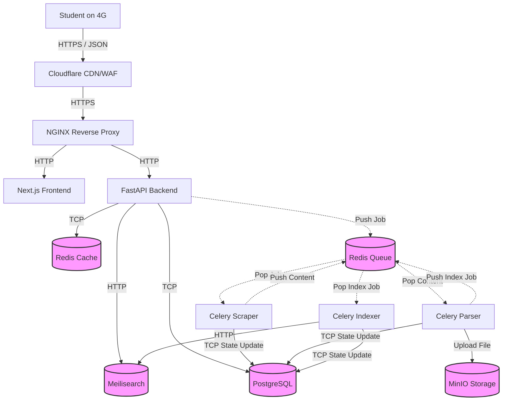
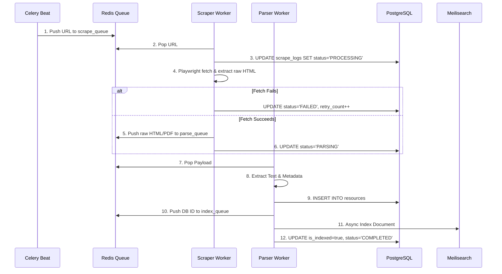

# Architecture Diagrams

> **Reasoning Preamble**
> Visualizing the architecture forces us to acknowledge failure domains. Every arrow in these diagrams represents a potential point of failure. If an arrow points from the API to the Scraper, the API is vulnerable to Scraper latency. By explicitly drawing queues (Redis) between them, we visually confirm the isolation of concerns. 

## 1. High-Level Architecture (C4 Container Level)

## 2. Ingestion Pipeline Traversal

